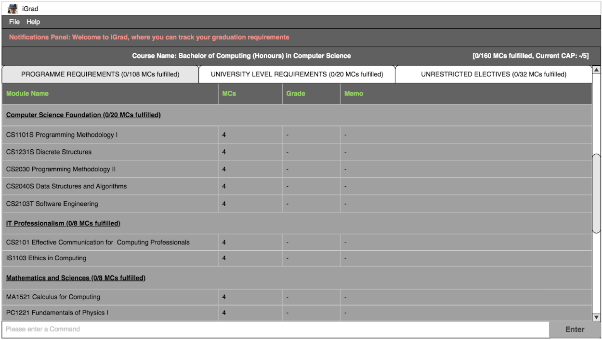

= Zhu Yijie - Project Portfolio
:site-section: AboutUs
:imagesDir: ../images
:stylesDir: ../stylesheets

== PROJECT: iGrad

== Overview

iGrad is a desktop module management and graduation tracking application. The user interacts with it using a CLI, and it has a GUI created with JavaFX, FXML and CSS.

== Summary of contributions

* *Major enhancement*: Added the *architecture for requirements and integrating the requirement feature with the course and module features*.
** _What it does_: Provides the requirement structure where modules can be assigned to, to keep track of the progress of a requirement.
** _Justification_: This feature is crucial in providing the ability for users to keep track of their graduation status through smaller categories known as requirements, instead of directly under a course.
** _Highlights_: This enhancement greatly increases the usability of the application because it makes course completion easier to track. It was also difficult to integrate this together with the course feature and the module feature since the code for this feature had to be written from scratch.
** _Credits_: The original Address Book 3 code which I referenced from the AddressBook structure as well as the Person structure to create this feature.

* *Major enhancement*: Added the *ability to add, edit and delete requirements*.
** _What it does_: Allows the user to add, edit and delete requirements.
** _Justification_: This feature improves the product significantly because it provides the flexibility for users to add their own requirement categories, edit them, and delete them if no longer needed.
** _Highlights_: Ensured that all the requirement properties, such as credits, are up-to-date after every command. The feature initially prioritized efficiency over modularity, but this caused issues as new requirement instances required manual calculations of the properties, prompting the change to a more modular implementation of the code.
** _Credits_: The original Address Book 3 code which I referenced to create the commands.

* *Minor enhancement*: Added the *ability to keep track of requirements being fulfilled*.

* *Code contributed*: [https://github.com/AY1920S2-CS2103T-F09-3/main/commits?author=yjskrs[All commits]] [https://nus-cs2103-ay1920s2.github.io/tp-dashboard/#=undefined&search=yjskrs[Project Code Dashboard]]

* *Contribution to Team Based Tasks*:
** Refactored the entire Address Book 3 into iGrad at the initial stage, while making sure the tests still pass so that my teammates can work on the refactored code without any issues.
** Managed the issue tracker throughout the semester, helping the team add issues and document bugs found along the way.
** Helped set up Coveralls and Codacy for the team.

* *Other contributions*:

** Project management:
*** Wrote the first draft of the User Guide with all the commands that our application would use. This was crucial in setting the direction of our application.
*** In charge of delegation of work and ensuring that the team completes their work on time.
*** Managed the issue tracker to reflect project progress at least once a week, assigning issues or bugs to the relevant teammate and closing issues when they have been resolved.

** Community:
*** PRs reviewed: https://github.com/AY1920S2-CS2103T-F09-3/main/pull/89[#89], https://github.com/AY1920S2-CS2103T-F09-3/main/pull/110[#110], https://github.com/AY1920S2-CS2103T-F09-3/main/pull/160[#160], https://github.com/AY1920S2-CS2103T-F09-3/main/pull/170[#170]
*** Reported bugs and suggestions for other teams in the class (examples: https://github.com/nus-cs2103-AY1920S2/addressbook-level3/pull/18#pullrequestreview-370037005[#18], https://github.com/nus-cs2103-AY1920S2/addressbook-level3/pull/45#pullrequestreview-382526605[#45])

== Contributions to the User Guide
|===
_Given below are the sections I contributed to the User Guide. They showcase my ability to communicate with end-users
of the product in question._
|===

include::../UserGuide.adoc[tag=command-yjskrs]
include::../UserGuide.adoc[tag=requirement-yjskrs]

<<<

== Contributions to the Developer Guide

|===
|_Given below are the sections I contributed to the Developer Guide. They showcase my ability to communicate technical
information into documentation as well as my contributions to the project._
|===

include::../DeveloperGuide.adoc[tag=requirement-yijie]

